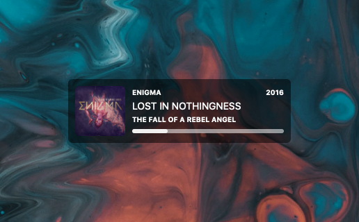

# Now Playing for [Übersicht][uber]
A music widget based on the [Playbox][playbox] widget by [Pe8er][pe8er] for [Übersicht][uber]. This widget shows the currently played song in either iTunes or Spotify. It shows the album artwork if it can find it and has a simple progress bar.

This widget would not be possible without the awesome work that [Pe8er][pe8er] has done on his [Playbox][playbox] widget.



# Features
- Supports iTunes and Spotify.
- Shows artwork (courtesy of [last.fm](http://www.last.fm)).
- Song progress bar.

# Options
There are a few options you can change by editing the index.coffee file.

```coffeescript
  # Enable or disable the widget.
  widgetEnable : true                   # true | false

  # Choose where the widget should sit on your screen.
  verticalPosition    : "bottom"        # top | bottom | center
  horizontalPosition    : "left"        # left | right | center
```

# Download

[Download Now Playing][download]

[uber]: http://tracesof.net/uebersicht
[playbox]: http://tracesof.net/uebersicht-widgets/#Playbox
[pe8er]: https://github.com/Pe8er
[download]: https://github.com/dionmunk/ubersicht-now-playing/raw/master/now-playing.widget.zip
