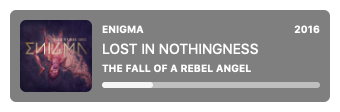

# Now Playing

A simple music widget for for [Übersicht](http://tracesof.net/uebersicht). Based on the [Playbox](http://tracesof.net/uebersicht-widgets/#Playbox)] widget by [Pe8er](https://github.com/Pe8er) This widget shows the current playing song in either iTunes or Spotify. It shows the album artwork if it can find it and has a simple progress bar.

## Screenshot



## Options

There are a few options you can change by editing the index.coffee file.

```coffeescript
  # Enable or disable the widget.
  widgetEnable : true                   # true | false

  # Choose where the widget should sit on your screen.
  verticalPosition    : "bottom"        # top | bottom | center
  horizontalPosition    : "left"        # left | right | center
```

## Installation

- Download the [repository](https://github.com/dionmunk/ubersicht-now-playing/archive/master.zip) and extract it.
- Place the `now-playing.widget` folder in your Übersicht extension folder.
- Refresh Übersicht.

## License

This work is licensed under a [Creative Commons Attribution-NonCommercial 4.0 International License](https://creativecommons.org/licenses/by-nc/4.0/).
